 ## linux_practice_projects
 LINUX: Linux is a family of open-source,unix-like Operating system based on the linux kernel. Linux uses a CLI(command line interface) for its navigation ,and here are some of the essential and basic commands needed for effective navigation around the linux environment.
  
## 1. Sudo command:
The sudo command, which is also known as the super- user do command,is used to grant administrative priviledges to a user to manipulate root files and folders. it allows a user access to elevated priviledges to system resources that cannot run under a regular account.

To use the SUDO COMMAND, we have to use the following syntax `sudo apt upgrade`. as it shows that i am currently not a super user and therefore do not have elevated priviledges'

## 2.pwd command:
The pwd  (present working directory) command shows the present working directory of a particular Linux user. It shows the present working location a user is currently on.

To use the PWD COMMAND, we have to use the following syntax `pwd`
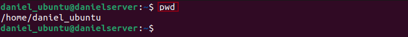
## 3.cd command:
The cd (change directory) command is used to navigate through the linux files and directories.It is used to change the current directory of a terminal.
To change directory from /home/daniel_ubuntu which is my home directory to my documents directory,we have to use the following syntax `cd Downloads`
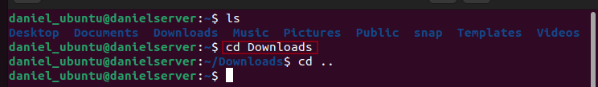
      
## 4.ls command:
The ls command is used to list the name and features of files and directories. it outlines the contents of a particular file or directory
To use the ls command,we have to use the following syntax`ls`
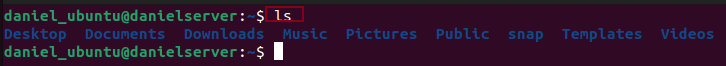
Here are some of the options you can use with the ls command
### A. ls -a: 
This shows hidden fies in addition to the visible ones. To use this command , we will have to use te following syntax `ls -a`

### B. ls -R:
This is used to list all files in the sub-directories. To use this command,we will have to use the following syntax  `ls -R`

### C. ls -lh:
This shows the files sizes in easily readable formats such as MB,GB and TB. To use this command, we will have to use the following syntax  `ls -lh`

## 5. cat command:
Cat command otherwise kmown as "concatenate" is used to read the content of a file or directory.It reads data from the file and gives its contents as output.
To use this command,we have to type cat followed by the file or directory to be read on your terminal.
For instance, if i want to read the file "Devops" on my terminal, ill need to use the syntax `cat Devops`

## 6. cp command:
cp command which is also known as the copy  command, is used to copy files into one or more Directories. It is also used to copy the content of a directory into another directory.To copy files to a directory,enter the file names followed by the destination directory as shown in the image below.
To use the copy command,we will have to use the following syntax `cp Devops /home/daniel_ubuntu/Documents`

## 7. Mv command:
The primary use of the move command, is to move and rename files and directories.The move command does not produce an output upon execution. To move a file, we simply type "mv" , followed by the filename and the destination.
To use the mv command, we will have to use the following syntax`mv Devops /home/daniel_ubuntu/Documents`

## 8. mkdir command:
This command is used to create one or multiple directories at once and set permissions for each of them. The user executing this command, must have the priviledge to make new folder in the parent directory, or they may recieve a permission denied error.
For instance to make a new directory called music inside my downloads directory, we use this syntax`mkdir Downloads/songs` 
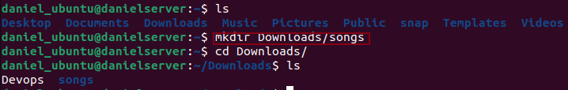.
## 9.rmdir command:
this command is used to permanently delete an empty directory.Also the user running this command should  have a sudo priviledges in the parent directory.For instance , to delete the songs directory from the downloads directory, we use the syntax`rmdir songs`
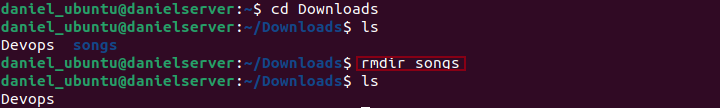
## 10.rm command:
the rm command is used to delete files within a directory.The user initiating this command must have write permissions.This action cant be undone as users must be sure to remember directory's location before doing so.For instance, to delete the devops file from the documents directory, we first change directory into the documents directory before using this syntax`rm devops`
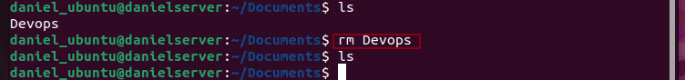
## 11. touch command:
this command allows to create an empty file or generate and modify a timestamp in the linux command line. For instance to create a new file 'devops' in the home directory, we need to use the following syntax`touch Devops`
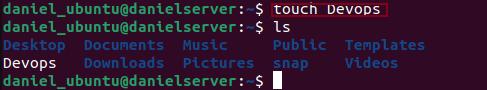
## 12.grep command:
the grep or global regular expression print ,lets you find a word by searching through all the text in a specific file. Once the grep command finds a match, it prints all lines that contains the specific pattern.For instance,if i what to search for the word "great devops", we need to use the following syntax `grep great devops`
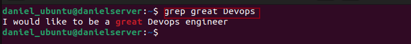
## 13. df command: 
this command is used to view the current directory's system hard disk space usage in a human-readable format.Here is an example sighted below

## 14. du command: 
this is used to check how much space a file or diectory occupies. this command can be used to identify which part of the system that uses the storage excessively.You must specify the directory path when using the du command.An example is sighted below`du/home/daniel_ubuntu/Downloads`
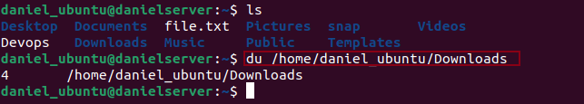
## 15. head command:
the head command allows you to view the first ten lines of a text.Adding an option lets you change the number of lines shown. it is also used to ouput piped data to the CLI. for instance,`head Devops` shows the first ten lines of the devops file.
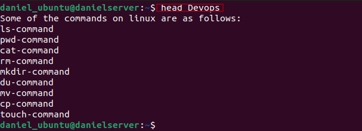
## 16. Tail command:
the tail command diplays the last ten lines of a file. it allows users to check wether a file has new data or to read error messages.
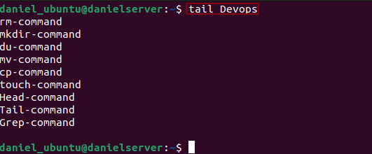.
## 17. diff command:
the difference command compares two contents of a file line by line.after analyzing them,it will display the parts that do not match. Programmers use this command to alter a program instead of rewriting the entire source code.
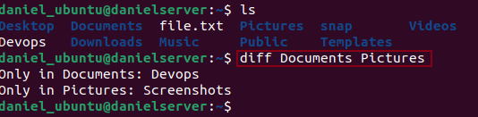.
## 18.tar command:
the TAR command achives multiple files into a TAR file, its a common linux format  similar to ZIP with optional compression.
## 19.locate command: 
the locate command can find a file in the database system.Adding the i-argument will turn off case sensitivity, so you can search for a file even if you dont remember its exact name. for instance,to locate a file on te server, we have to use the syntax `locate file2.txt`
.
## 20.find command:
the find command is used to search fo files within a specific diretory and perform subsequent operations. For instance to search for file2.txt in the home file we use the syntax `find ~ -name 'file2.txt'`
 

# INTRODUCTION TO LINUX AND BASIC COMMANDS
Linux is a family of open-source operating system based on the Linux kernel,they include UBUNTU, FEDORA,DEBIAN,openSUSE,and REDHAT.It is highly recommended to use the CLI(the command line interface) when accessing the operating system services either than the regular GUI(graphical user interface) because it is quicker and offers more control.
## what is a Linux command?
A linux commmand is a program or utility that runs on the CLI( a console that interacts with the Linux ooperating system via text and processes). Linux commands are executed on the terfminal by enter at the end of each command line.

# FILE PERMISSION AND OWNERSHIP COMMANDS
## 21. chmod command:
chmod is a common command that modifies a file or directory's read,write and execute permissions.In Linux,each file is associated with three user classes;
 owner,group members and others. 
 for instance,if i want the change the permissions of the file2.txt to be able to be read ,write and excuted by the three user classes,i will use the syntax `chmod 777 file2.txt`
 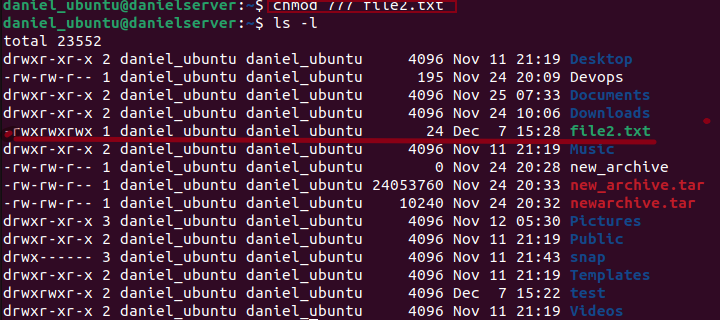.
 ## 22. chown command:
 the chown command lets you change the ownership of a file ,directory or symbolic link to a specified username.  for instance to change the group ownership of the directory 'snap',we have to use the syntax `sudo chown :daniel snap`
 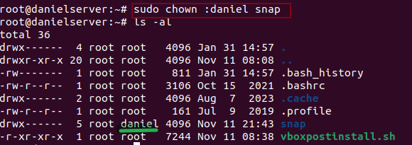.
 ## 23. jobs command:
 A job is a process that the shell starts.it displays all the running processes along with their statuses. this command is only avaliable in csh,bash,tcsh,and ksh shells.

 ## 24. kill command:
 The kill command terminates an unresponsive program manually.It will signal misbehaving applications and instruct them to close their processes. To kill a program, you must know its procss identification number(PID).
 

 ## 25. ping command:
 The ping command is one of the most used basic Linux command for checking wether a network or server is recheable. In addition, it is used to trouble-shoot various connectivity issues. To use the ping command to check for connectivity to the google.com website,i used the syntax `ping -c 6 google.com` -c 6 implies the limitation of replies i am supposed to get.
 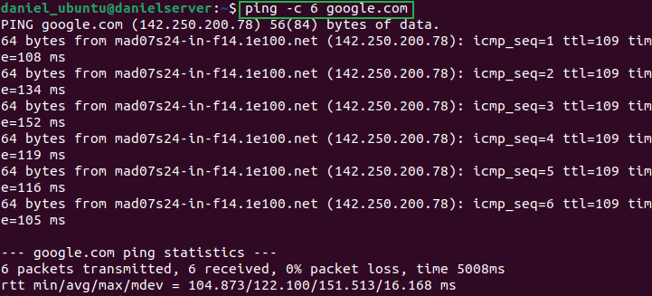.

 ## 26. wget command:
 The Linux command line lets you download files from the internet using the wget command. it works in the background without hindering other running processes. The wget commmand retrives files using HTTP,HTTPS, and FTP protocols.It can perform recursive downloads which transfers websites parts by following directory structures and links, creating local versions of the web page.To use the wget_command to the darey.io website we use the syntax `wget http//darey.io/learning path.`
 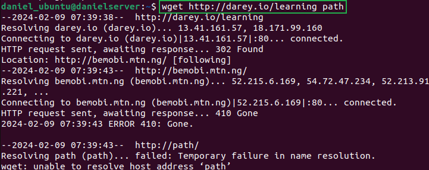.

 ## 27. uname command:
 The uname or unix name command will print detailed information about your linux system and hardware.This includes the machine name,operating system,and kernel.To run this command,simply enter uname into your CLI.For instance using this syntax `uname -a, uname -s, uname-n`i get detailed information about my Linux system.
 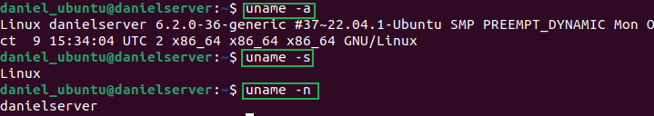.

 ## 28. top command:
 the top command in Linux terminal will display all the running processes and a dynamic real-time view of the current system. It sums up the resource utilization from CPU to memory usage. The top command can also help you identify and terminate a process that may use too many system resources. To initiate this command we use the syntax`top`on the CLI
 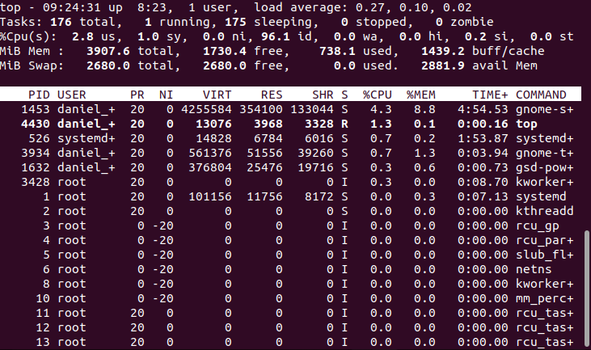.

 ## 29. History command:
 With history, the system will list up to 500 previously executed command, allowing you to reuse them without re-entering. Keep in mind that only users with SUDO privileges can execute this command. How this utility runs also depends on which Linux shell you use.To use this command, we just have to input the syntax `history`on our CLI.
 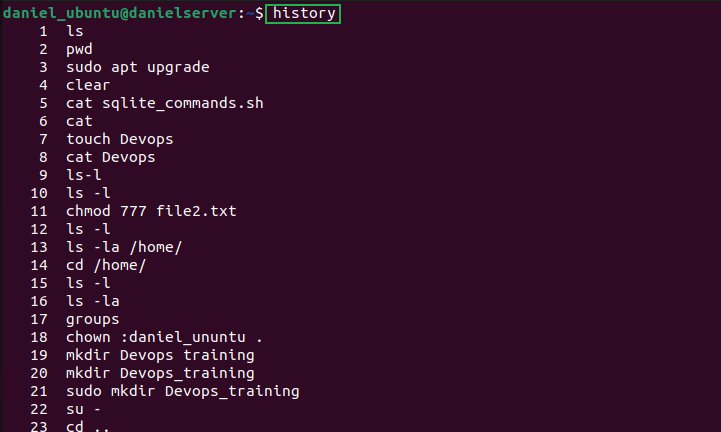.

 ## 30. Man command:  
 this command provides a user manual of any command or utilities you can run in terminal ,including the name,description and options.For instance, to access the manual of the Ls command on the CLI, we use the syntax `Man -ls`
 .

 ## 31. Echo command:
 the echo command is a built in utility the displays a line of text or string using the standard output.To use the echo command, we have to use the syntax `echo "i am a devops engineer`
 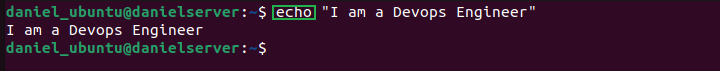.

 ## 32. zip,unzip command: 
 the zip command is used to compress a file into a zipped file. A universal format commonly used on Linux. It can automatically choose the best compression ratio. The zip command is also useful for achieving files and directories and reducing disk usage.here are some group of files comprssed int a zipped folder by using the syntax `zip zipfile.zip file1.txt file3.txt file4.txt`.
 

 ## 33. Hostname command:
 This command is used to know a systems hostname,which can be executed with or without an option.to get the hostname for my server we need the input the syntax`hostname`
 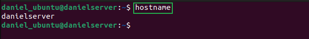.

 ## 34. useradd,userdel commands:
 Linux is a multiuser system,meaning more than one person can use it simultaneously.useradd is used to create a new account,while the password command allows you to add a password.only those with root privileges or SUDO can run the useradd command. 
 

 ## 35. apt-get command:
 apt-get is a command line tool for handling Adavanced Package Tool (APT) libraries in linux.it lets you retrieve information and bundles from authenticated sources to manage,update,remove,and install softwaare and its dependencies.For instance, if i want to install the locate command, i could use the syntax`apt-get install locate`.meanwhile, this command works under sudo privileges.
 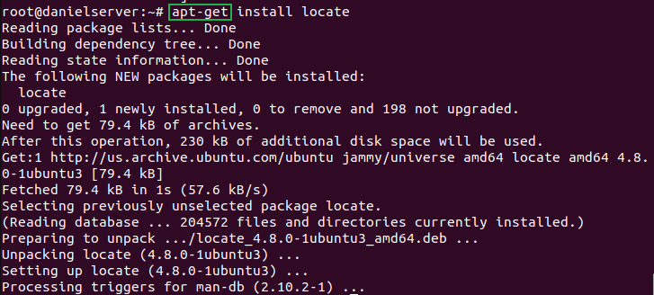
 
 ## 36.nano,vi,jed commands: 
 linux allow user to edit and manage files via a text editor,such as nano,vi,or jed. nano and vi come with the operating system,while jed has to be installed.For instance, if i want to edit the file "file2.txt" we use the syntax `nano file2.txt`
 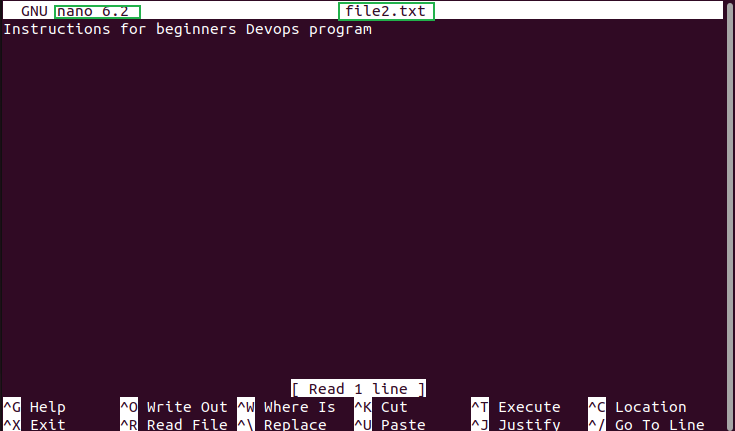
 

 ## 37.alias,unalias commands:
 alias allows you to create a shortcut with the same functionality as a command,file name,or text.when executed,it instructs the shell to replaced one strings with another. For instance, i created a shortcut for the long list of files (ls -al) to be subtituted for "mycmd" using the syntax `alias mycmd="ls -al"`
 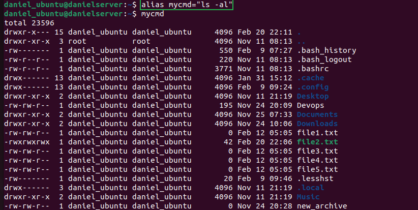

 
 ## 38.su command: 
 the switch user allows you to run a program as a program as a different user.It changes the administrative account in the current log-in session.This command is especially beneficial for accessing the system through SSH or using the GUI display manager when the root user is unavailable. To switch to a super user, i just input the command `su` followedn by my password.
 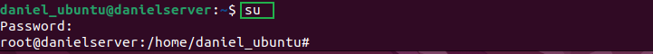

 ## 39.htop command:
 The htop command is an interactive program that monitors system resources and server processes in real time.it is available on most linux distributions,and you can install it using the default package manager.
 compared to the top command,htop has many improvements and additional features,such as mouse operation and visual indicators.To monitor my system server processes i will have to input the command `htop` on my terminal.
 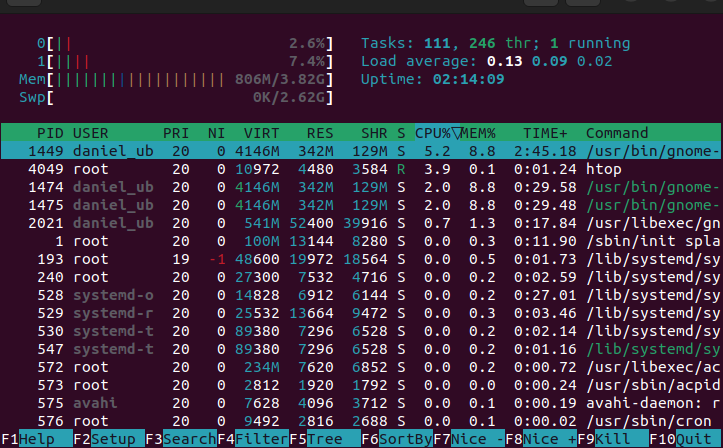

## 40.ps command:
The process status or ps command produces a snapshot of all running process in your system.The static results are taken from the virtual files in the/proc file system.Executing the ps command without an option or argument will list the running processes in the shell along with:The unique process ID(PID)The type of the terminal (TTY)The running time(TIME)The command that launches the process(CMD). we can run the ps command by inpting `ps` on our terminal'
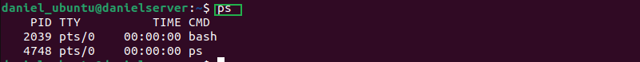.

