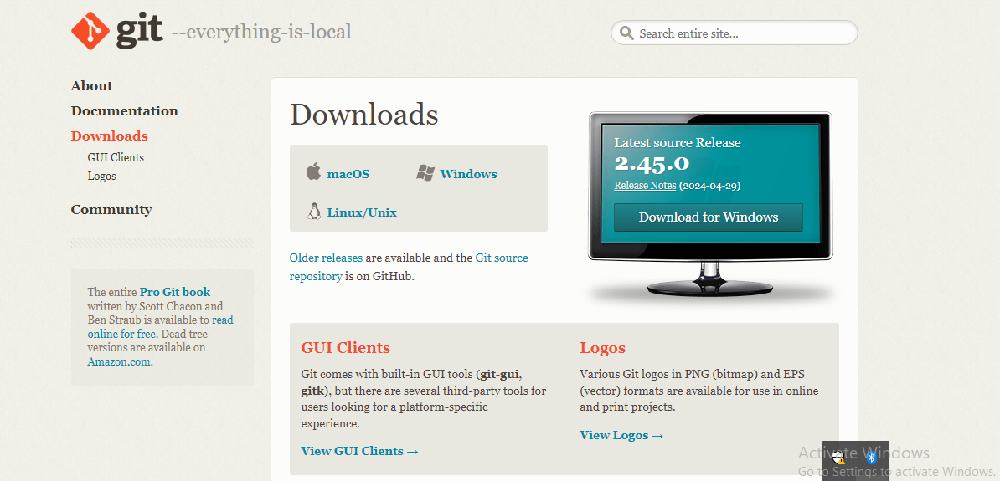
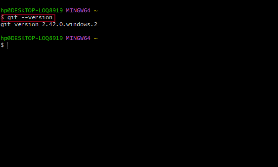
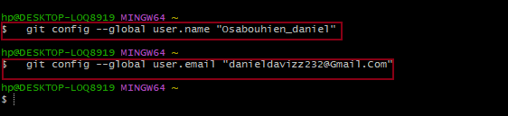
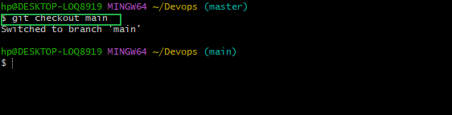
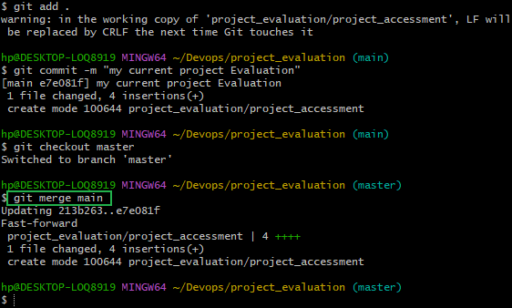
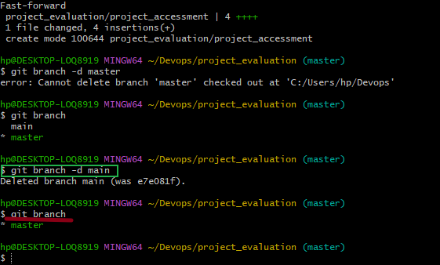

# GIT_PROJECT
 Git is a powerful distributed version control system that enables users to efficiently initialize a repository,enable commits work with branches,collaboration and remote Repositories and also tagging track changes. Git helps to collaborate on projects amongst technical teams.

 ## steps required to download Git.
1. Download and install Git from  https://git-scm.com/downloads. 

2.Check if the git version is fully operational on your pc.

3. Be sure to configure you username and email on git bash.

4.Create a repository by creating folders with neccessary files we need.

# steps to taking my local repository to git hub website.
 Once our project has been completed it needs validation from the public eye.Hence, we have to push or forward our projects to github website by some few simple steps. these steps are discussed below;

 ## initializing a Git Repository
  This process is only possible after installing Git on your operating system.
    Here, are some of the things to do inorder to initialize your git Repository.

 **a**. install git on your system.
 
 **b**. create a Devops folder on your terminal by using the command `_mkdir Devops_`

 **c**. Change or move into your Devops working directory using the command `_cd Devops_`
 
 **d**. while in this folder we initialize git be using the command `_Git init_`

 

 ## First commit
 commit means saving the changes done to your work and, this can include adding ,modifying or deleting text or files. making a first commit requires these following steps:

 **a**. In your working directory, create a file `_indx.txt_` using the touch command.

 **b**. write any sentence of your choice inside the text file.Afterwards, save your changes.

 **c**.Add the changes made to the git staging area using the command `_git add_`.

 **d**. To commit the changes to git,run the command `_git commit -m "initial commit"_`

## Working with Branches.
  A git branch helps you create a different copy of your source code.In the new branch,you can make changes as you please.the change is independent of what is avaliable in the main copy. A git branch is an important tool for collaboration within remote teams.

  ### making my first Git Branch.
  To make a new branch,we must run the command _`git checkout -b`_. the _-b flag_ helps  you create and change into the new branch.
  We can make our first branch with these few simple steps.

  **a**. having made the first commit i the previous lesson,

  **b**.Make a new branch by running this command _`git checkout -b my-new-branch`_

### Listing my Git branches.
We can list our branch on our local repository using the command _git branch_

### Changing into an old Branch.
we can as well change into an old branch using the command _git checkout main_

### branch merging.  
Lets say we have two branches A and B, and we want to add the content of B into A.First, we change into branch A and run the git command _`git merge B`_

### Deleting a git branch.
 when a new feature s added to an application, it is often done in a feature branch.Usually this feature branch is deleted when the code must have tested and merged into a staging or dev environment
 depending on the branch stategy of the team. git branch can be delete with the command _`git branch -d main`_
  
 To double-check if the branch have been deleted, you can use the command _`git_branch`_.
 
 